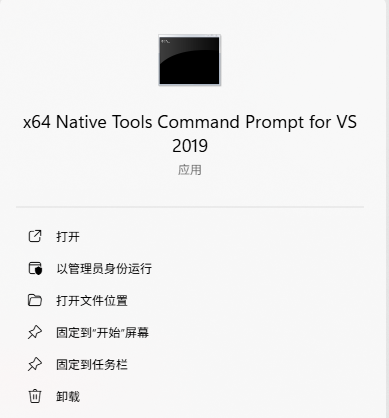

# ICC Viewer - Object Detection Software

A PyQt-based image software that supports local video and USB camera, with real-time switching between Grounding DINO and YOLOv5 models for object detection.

## Features

### 🎥 Video Input
- **USB Camera**: Real-time USB camera reading
- **Local Video**: Support for playing local video files (mp4, avi, mov, mkv)
- **Real-time Switching**: Seamless switching between camera and local video

### 🤖 Detection Models
- **Grounding DINO**: Text-prompted object detection
  - Support for custom text prompts
  - Adjustable box threshold and text threshold
  - Suitable for open-vocabulary detection
- **YOLOv5**: Traditional object detection
  - Support for multiple pre-trained weights (n, s, m, l, x)
  - Adjustable confidence and IoU thresholds
  - Suitable for predefined category detection

### 🖥️ User Interface
- **Modern UI**: Modern interface based on PySide6
- **Responsive Layout**: Support for window size adjustment
- **Fullscreen Mode**: Double-click video area or press F11 for fullscreen
- **English Interface**: Fully English user interface

### ⚙️ Advanced Features
- **Real-time Detection**: 30fps real-time object detection
- **Video Recording**: Support for recording detection results
- **Downsampling Option**: Optional 0.5x downsampling for performance improvement
- **Model Switching**: Dynamic model switching at runtime
- **Parameter Adjustment**: Real-time detection parameter adjustment

## Installation Requirements

### System Requirements
- Python 3.8+
- CUDA support (recommended for GPU acceleration)
- At least 4GB RAM
- USB camera or video files

### Dependency Installation

1. **Clone the project**:
```bash
git clone <repository-url>
cd ICCViewer
```

2. **Install Python dependencies**:
```bash
conda create -n iccviewer python=3.9
conda activate iccviewer
pip install -r requirements.txt
```

3. **Build GroundingDINO, Yolov5, Crocodino (WINDOWS & LINUX)**:

- If it is on windows
   - Install CUDA Toolkit
   - Install VS 2019 Compiler
   - Run command on `X64 Native Tools Command Prompt for VS 20xx .exe`


Build GroundingDINO
```bash
cd GroundingDINO
python setup_LINUX/WIN.py build_ext --inplace
```
Build yolov5
```bash
cd yolov5
pip install -r requirements
```

Build Crocodino
```bash
cd crocodino
pip install -r requirements.txt
cd models/dino/ops
python setup.py build install # use 
```

## **Model Zoo**:
|Model|Level|Address|
|---|---|---|
|GroundingDINO|Original|[groundingdino_swint_ogc.pth](https://drive.google.com/file/d/1MIu7DTZEtRrE649K1WFg4RwLn02nN-UB/view?usp=sharing)|
||Low|[groundingdino_finetuned_misc.pth](https://drive.google.com/file/d/1ev4JdgCoW8K-a9xLCJSWd_lt-XuOxBag/view?usp=sharing)|
||Moderate|[groundingdino_finetuned_moderate.pth](https://drive.google.com/file/d/1o-XIo4r6QCRryvd4I3miQ7wrP4U2wXCj/view?usp=sharing)|
|CrocoDINO|Low|[crocodino_low.pth](https://drive.google.com/file/d/1e-gX0ZLt7VHZ2cOD1h329DXRycqRfmH-/view?usp=sharing)|
||Moderate|[crocodino_moderate.pth](https://drive.google.com/file/d/1OIw3BUAiuC1jPFPOBg1H9uj0nqrU2hSy/view?usp=sharing)|
||High|[crocodino_high.pth](https://drive.google.com/file/d/1gQo33kF1LPZOh24Ygqf6-lk0InmGmKRd/view?usp=sharing)|
|LGTrack|-|[lgtrack_init.pt](https://drive.google.com/file/d/1wco25h5_DP80tajqkFbp2lIxq7AHtQ5m/view?usp=sharing)|

## Usage

### Starting the Software
```bash
python main.py
```

### Basic Operations

1. **Select Detection Model**:
   - Choose "Grounding DINO" or "YOLOv5" from the dropdown menu
   - Models will automatically load and switch

2. **Using Grounding DINO**:
   - Enter the object to detect in the text prompt box (e.g., "crocodile", "person", "car")
   - Adjust box threshold and text threshold
   - View real-time detection results

3. **Using YOLOv5**:
   - Select pre-trained weights (n/s/m/l/x)
   - Adjust confidence and IoU thresholds
   - View detection results for predefined categories

4. **Video Operations**:
   - **Play Local Video**: Click "Play Local Video" button to select file
   - **Pause/Resume Camera**: Click "Pause Camera" button
   - **Start/Stop Saving**: Record detection results to video file

5. **Fullscreen Mode**:
   - Double-click video area to enter fullscreen
   - Press ESC or F11 to exit fullscreen

### Advanced Settings

- **Downsampling**: Check "Downsample Input" for performance improvement
- **Parameter Adjustment**: Use sliders to adjust detection parameters in real-time
- **Weight Switching**: Switch between different model sizes in YOLOv5 mode

## File Structure

```
ICCViewer/
├── main.py              # Main program file
├── config.py            # Configuration file
├── requirements.txt     # Python dependencies
├── README.md           # Documentation
├── run.sh              # Startup script
└── app_error.log       # Error log (generated at runtime)
```

## Troubleshooting

### Common Issues

1. **Camera cannot be opened**:
   - Check if USB camera is properly connected
   - Confirm camera is not occupied by other programs
   - Try restarting the software

2. **Model loading fails**:
   - Check if model weight files exist
   - Confirm CUDA environment is properly configured
   - View error log for detailed information

3. **Performance issues**:
   - Enable downsampling option
   - Use smaller model weights
   - Close other GPU-occupying programs

4. **Interface display issues**:
   - Check if PySide6 is properly installed
   - Confirm display settings
   - Try running in headless mode

### Logging
The software generates an `app_error.log` file during runtime containing detailed operation logs and error information.

## Development Notes

### Architecture Design
- **VideoThread**: Independent thread responsible for video capture
- **DetectorManager**: Manages loading and switching of different detection models
- **MainWindow**: Main interface and user interaction logic

### Extending Features
The software uses a modular design that makes it easy to add new detection models:
1. Add new loading methods in `DetectorManager`
2. Add corresponding UI controls in `MainWindow`
3. Add detection logic in `update_frame`

## License

This project is open source under the MIT license.

## Contributing

Welcome to submit Issues and Pull Requests to improve this project.

## Contact

For questions or suggestions, please contact through:
- Submit GitHub Issue
- Send email to project maintainer 